# 分布式系统Failover测试框架的实现

## 摘  要

Failover是指系统处理故障并恢复的过程，目前大多数分布式系统都实现了自动Failover的机制，即使发生局部失败也能继续提供服务。Failover测试则是通过主动注入错误，模拟出各种软硬件故障，以此检验在失败和恢复时系统的健壮性。

我们内部的分布式系统已经部署在上千台普通服务器上，软硬件故障时有发生，进行Failover测试成了系统开发的必备环节。传统的测试方法需要人工参与，自动化程度低，我们亟需一个高效的Failover测试框架确保系统满足高可用的需求。于是我们实现了一个针对分布式系统的Failover测试框架，这个框架有错误注入功能，同时能够对系统进行数据验证，还有Web页面展示等功能。

本论文将会介绍这个分布式系统Failover测试框架的需求分析，讲述我们实现此测试框架的开发动机和调研成果；然后详细介绍这个测试系统的实现原理，了解测试框架的基本架构与实现细节；最后介绍我们进行Failover测试的应用情况，探讨Failover测试的最佳实践以及工作总结。

通过对此测试框架的实现，大大提高了我们对Failover测试的理解和重视，我们在生产环境中应用此框架对多个分布式系统进行了Failover测试，不仅找到了系统潜在的缺陷，也极大提高了我们对系统健壮性的信心。

关键词：分布式系统；Failover测试；测试框架

## Abstract

Failover is the process for system to recover from failure. Nowadays most distributed systems are able to automatically failover, so partial failures hardly have an effect on their services. Failover test is used to inject failures through simulating software and hardware errors. And it helps to examine the robustness of the system.


We have deployed our distributed systems on hundreds of commodity servers. The failures of software and hardware are inevitable, so failover test becomes the necessary part of software development. The traditional methods of failover test require human intervention. But we need a more practical failover test framework to test our distributed systems. Then we implemented the failover test framework for distributed system, which can inject failure, validate data of system, display status on Web UI and so on.


This paper will introduce the needs of this failover test framework. We will talk about the motivation and our research. Then it presents the implementation in detail and analysis the architecture of the test framework. Finally we will make a conclusion of our failover test. We would love to talk more about our best practices and relative works.


After implementing this failover test framework, we know more about failover and pay more attention to failover test. We have performed failover test for some distributed systems in the production environment. As a result, some potential bugs were found because of it and we have much more faith in our distributed systems.

Keyword: Distributed System, Failover Test, Test Framework
 

## 目录

* 摘要  
* Abstract  
* 第一章 绪论  
  * 1.1 选题背景  
  * 1.2 调研情况  
  * 1.3 研究内容	 
* 第二章 测试框架的需求分析  
  * 2.1 需求概述  
  * 2.2 需求分析	 
  * 2.3 本章小结  
* 第三章 测试框架的架构设计  
  * 3.1 框架总体架构  
  * 3.2 外部模块架构  
  * 3.3 本章小结  
* 第四章 测试框架的实现原理  
  * 4.1 测试框架实现概述  
  * 4.2 实现策略设计模式  
  * 4.3 实现系统三层架构  
  * 4.4 实现参数可配置化  
  * 4.5 实现故障重现功能  
  * 4.6 实现数据验证功能  
  * 4.7 实现页面展示功能  
  * 4.8 实现数据统计功能  
  * 4.9 实现硬件级别故障  
  * 4.10 实现外围测试工具  
  * 4.11 实现通用测试模块  
  * 4.12 实现工厂设计模式  
  * 4.13 本章小结  
* 第五章 测试框架的最佳实践  
  * 5.1 实践概述  
  * 5.2 实践系统  
  * 5.3 实践问题  
  * 5.4 本章小结  
* 结  论  
* 参考文献  
* 致谢
 

## 第一章 绪论

### 1.1 选题背景

随着互联网的发展，分布式系统[1]以其低廉的成本、强大的运算能力和健壮的容错机制逐渐成为计算机行业的焦点。分布式应用可以运行在上千台普通服务器上，伴随业务增长动态扩大集群规模，但也要承受普通计算机相对较高的硬件故障率，这要求系统在发生软硬件故障时仍能保证一定的可用性[2]。而测试程序的这种容灾能力成了分布式计算时代的另一大难题。

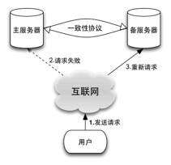

图1-1 分布式系统Failover流程



图 1-2 测试框架基本功能

Failover[3]测试也称为故障恢复测试[4]，用于验证系统在发生故障时能否迅速恢复服务。图1-1表示分布式系统的Failover流程，通过一致性协议[5]保证主服务器和备服务器数据的一致，因此即使系统的主服务器发生了故障，备服务器也能马上接替服务，局部故障也就不会影响到对外的服务质量。当然，实现这种高可用需要开发者额外的付出，编码过程中可能存在的缺陷也需要有全面的测试。Netflix在亚马逊云服务出现故障后发表文章[6]说明了Failover测试的重要性，在软硬件故障不可避免的今天，通过人为提高软硬件故障率能够提前暴露系统的问题，是一种更加有效的预防措施。相比单元测试和集成测试，Failover测试尚未得到广泛关注，大部分分布式应用在实现功能需求后直接上线，一旦在线上发现问题再人工处理，这种没有通过任何测试、有损用户体验的做法是很不值得提倡的。由于缺少足够的Failover测试方法和测试工具，目前国内外对这项测试工作仍不够重视。

Failover测试框架[7]是进行Failover测试的工具，如图1-2所示，测试框架主要是能够提供错误注入的方法进行软硬件故障的模拟，同时也要有数据验证和页面展示等辅助功能，最好为测试人员和开发人员提供不同的接口来使用和拓展测试框架。由于是针对分布式系统进行测试的，此测试框架必须足够简单易用，为测试人员提供友好的用户界面，框架在实现基本功能外，不能引入其他的缺陷，最好能够方便其他开发者拓展此框架的功能。

根据业务需求，我们的生产环境中已经部署了多套分布式存储和计算系统，如HBase[8]、HDFS[9]、ZooKeeper[10]和Chronos[11]等等。这些系统在设计时考虑到高可用性的需求，都实现了各自的Failover机制，但由于编码出错或者一些未知因素可能导致线上的系统并没有达到我们的预期，于是我们必须实现一个通用的Failover测试框架，来检测系统故障恢复的能力并找出代码中可能存在的Bug。

### 1.2 调研情况

在设计和实现我们的Failover测试框架之前，我们对国内外已经存在的测试框架进行了调研。通过调研收集资料，有助于我们分析Failover测试框架的功能特性，为我们设计和实现自己的测试框架做好准备。

参考国外开源项目的设计，我们首先找到针对HBase进行集成测试的ChaosMonkey[12]。HBase[13]是一个分布式的NoSQL数据库，在集群里任意一台服务器挂了以后其他服务器可以迅速接替服务，保证系统在任何时候都是高可用的。ChaosMonkey是HBase项目的一个测试模块，它通过向集群随机发送操作指令，测试HBase在这种外界干预下能否继续正常工作，它的缺点是只停留在进程级别的错误注入而不能模拟硬件级别的故障。ChaosMonkey在HBase项目中应用广泛，每次发布新版的HBase时都必须经过严格的系统集成测试，其中就包括使用ChaosMonkey来检测系统的健壮性，这样可以保证Failover测试像单元测试那样持续被执行，但由于针对性强，其他分布式系统就难以复用此代码。另一个值得借鉴的是Netflix开源的SimianArmy[14]项目，它拥有软硬件故障的全套解决方案，但是灵活性比较差并且不容易拓展。虽然这个项目已经开源，但仍没有得到外界更多的关注，粗略看了一下代码感觉实现还是比较粗糙，硬件故障的模拟也比较简单，难以迁移到我们庞大的服务器集群上。当我们向HBase社区反馈[15]准备实现这个Failover测试框架时，得到了Cloudera公司Todd Lipcon的建议，他已经开源实现了一个轻量级的测试框架Gremlins[16]，不过整个测试框架的架构过于简单，故障模拟都只能发生在本地，缺乏对整个集群的测试能力。Gremlins项目至今已经有四年没有更新了，当初也只是为HBase数据库设计，缺乏足够的通用性，整个框架从现在的角度看还是稍有些落后。

通过对比和学习这些开源项目，我们觉得目前的Failover测试框架功能不够完善，可用性、易用性和可拓展性都不能满足我们的需求。所以我们需要实现新的Failover测试框架，为我们的分布式系统测试提供一套完整的解决方案。

### 1.3 研究内容

总结前面的背景调研，我们认为Failover测试框架除了要实现错误注入、故障模拟功能，还必须提供数据验证和页面展示模块，同时要保证可拓展性用于其他异构的分布式系统，最好还要有数据收集、邮件报警等辅助功能。因此，我们在框架设计与实现上都花了不少功夫，而且在进行Failover测试的过程中也遇到了不少问题，包括发现被测系统存在的漏洞和测试框架自身执行时产生的问题，本论文将会详细叙述以上提到的各部分内容。为此，我们进行了下面的研究工作：

1. 研究测试框架的需求设计，为系统的实现提供理论基础。
2. 研究测试框架的架构设计，探讨框架的解耦与系统组件。
3. 研究具体的代码实现，更好地理解测试框架的实现原理。
4. 研究测试框架的实践情况，总结生产环境中的最佳实践

本论文的余下部分将围绕这四个章节来展开。第二章是测试框架的需求设计，我们从功能需求和非功能需求两个角度探讨分布式系统Failover测试框架的需求，并总结出项目开发所要实现的所有功能模块。第三章是测试框架的架构设计，我们会从整个测试框架的总体架构入手，分析系统各组件的分层与解耦，然后剖析一些外部模块的系统架构，最后归纳出我们实现时所遵循的项目框架。第四章是测试框架的实现原理，也是本论文研究最重要的一部分，我们会对每个功能模块进行划分，然后分别详细地讲解其中的实现细节，力求让所有人看过本章都可以实现自己的测试框架。第五章是测试框架的最佳实践，也就是我们对此测试框架的使用情况，我们已经在生产环境中进行Failover测试，取得了一定的成效，这些内容都会在这章内逐一叙述。
 

## 第二章 测试框架的需求分析

### 2.1 需求概述

在设计一个切实可用的系统之前，我们必须明确理解我们的项目需求和最终的实现成果。和其他测试框架一样，这个项目的用户是测试人员和开发人员，目的是为了检验软件程序中可能存在的漏洞。

因此要实现测试框架的功能需求，必须提供一个可执行的测试程序，并实现基本的测试功能。对于Failover测试，我们必须能够模拟出各种软硬件故障，实现错误注入的功能，为了验证分布式系统的内部运行状态，我们在测试时也要能够进行数据的验证和集群健康状况的检测。这些都需要封装到最终的测试框架中，实现上述提到的功能需求。

同时也要满足测试框架的非功能需求，在易用性、拓展性方面能够达到测试人员的预期。目前主流测试框架的日志都是直接输出到终端或者文件中，但Failover测试是一个相对持久的测试过程，通过看Log了解测试结果显然是不合理的，我们认为Web UI对测试人员是最友好的，也能极大提高测试框架的易用性。除此之外，我们还要实现框架的可拓展性，补充足够的使用文档，这些都是我们满足非功能需求的必备环节。

### 2.2 需求分析

针对上述的功能需求和非功能需求，我们得到了图2-1这样的用例图。

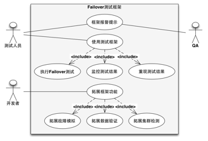

图2-1 需求用例图

首先从测试人员的角度，最重要的是使用测试框架进行测试，其中就包括执行Failover测试，同时要能够随时监控测试的结果，而一旦检测出系统的问题后，能够马上重现这个测试结果。而QA和测试人员一样，如果发现系统潜在的Bug后能马上收到框架的报警提示。对系统开发者来说，这个测试框架能够提供了接口来拓展新的测试功能，其中就允许开发者拓展故障的模拟，也可以拓展框架中数据验证和集群检测的功能。

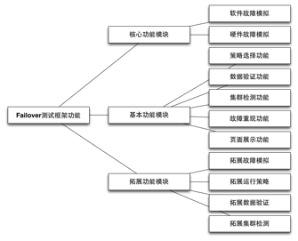

图2-2 系统功能架构图

我们整理得到了图2-2的系统功能架构图，我们首先要能够实现不同级别的故障模拟，也就是说必须可以模拟软件进程级别的错误，如杀掉或者重启进程，也要能够模拟硬件级别的失败，如果网络超时、CPU负载过高等问题。其次是在注入错误的同时，应该有外围的工具来进行数据验证，而且我们觉得除了每次测试时需要验证数据，还必须要有一个持久的测试工具贯穿Failover测试的各个生命周期，这是检验系统健康状况的标准之一，如果数据验证出错，说明系统存在缺陷，需要开发人员进一步定位代码中的问题。而且我们是设计一个测试框架，具体的故障模拟和策略选择应该允许用户来拓展，不同分布式系统的数据验证方式不同，测试框架只需要提供统一的接口，由开发者实现针对异构系统的数据验证功能。这个框架运行所需要的所有参数都应该是可配置的，通过配置文件来指定执行具体的操作，无需改动源代码或者重新编译，能够极大地提高系统的可拓展性。而一旦发现了问题，我们应该能立刻停止测试框架的执行，然后尽量重现这个问题，于是我们就需要提供这种Replay机制，这也是一个Failover测试框架所应该支持的，而不需要给测试人员额外的负担。由于系统故障发生率较低，出现问题后能够马上重现可以大大减少我们排查问题的时间。为了简化框架的运行环境，我们希望将系统的运行状态展现在Web界面中，用户通过浏览器就可以访问而不需要安装其他客户端，页面展示的内容也应该齐全方便测试人员定位问题。考虑到测试应尽可能自动化，一旦测试框架发现问题后直接给相关人员发送报警邮件，这就省却了测试人员无休止的定期检查工作，大大减少了系统的运维成本。最后我们也希望这个框架是简单易用的，暴露给用户的接口也要足够简单，通过一行命令来编译、启动和停止测试框架。

### 2.3 本章小结

本章以图表和文字的形式描述分布式系统Failover测试框架的需求，简要说明了功能需求和非功能需求，列举出系统的的功能架构，目的是要实现一个功能完整、易用、并且易拓展的测试框架。通过对系统需求的描述，为后面的项目开发提供了良好的理论基础和实现准则。

## 第三章 测试框架的架构设计

### 3.1 框架总体架构

根据上述制定的需求，我们设计出以下的系统总体框架。


图3-1 系统总体架构图

根据图3-1我们可以了解到整个测试框架的总体架构。左侧MachineFailover是模拟硬件故障的一个外部模块，它内部实现了一个Flask HTTP服务器来接受测试框架发出的错误注入请求，然后给测试服务器发送模拟硬件故障的命令。右侧是一个数据收集和展示的模块，它集成到我们已经开源的Minos项目中，通过启动一个Django服务器，收集测试框架产生的历史数据并友好地展示出来。中间是分布式系统Failover测试框架的主体部分，主要包括以下几个组件，ExternalTool是一个外围测试工具，DataValidator用于验证系统数据的一致性，ClusterChecker则是检测集群的健康状况，Task是实际执行的错误注入结合，包括模拟的故障Action、执行策略Policy和选择器ActionProvider，HttpServer则是用于展示测试框架运行信息的HTTP服务器。

在测试框架主体模块我们采用了Policy/Task/Action三层架构。Policy表示我们运行错误注入的策略，例如我们可以随机执行故障模拟或者按顺序模拟各个故障，甚至还可以Replay一组任意的故障组合。Task则是指将要执行的错误注入的集合，它是每次Failover测试的基本单位，也是我们要重现故障时Replay的最小单元。最后Action代表一个实际的错误，也就是我们能够模拟的各类软硬件故障。通过对系统进行这三种粒度的划分，我们测试框架的架构就更加清晰了，拓展性也更强。例如我们如果想使用新的策略模式，通过继承Policy实现特定的接口就可以了，如果我想添加新的故障模拟，只需继承Action这个接口就可以无隙集成到这个Failover测试框架中。

其次我们定义了测试框架的基本组件，除了故障模拟这个工具外，我们还设计了DataValidator、ClusterChecker和ExternalTool这几个部件。在运行Failover测试框架前我们需要指定将要执行的Actioin，而我们提供了ActionProvider这个基本组件，目前已经实现了HBaseActionProvider、HdfsActionProvider、EnvironmentActionProvider、FileActionProvider和ScriptActionProvider，你可以针对HBase、HDFS这些分布式系统分别进行测试，也可以模拟出硬件环境的故障。如果有新的异构分布式系统希望进行Failover测试，只需要在这里拓展ActionProvider就可以添加新的Action集合了。另一个基本组件DataValidator是测试框架的数据验证工具，在Failover测试过程中系统能够保证数据一致性也是很重要，例如针对HBase的测试我们会通过HBaseDataValidator不断地读写数据库来验证数据一致性。而ClusterChecker是测试框架的另一个重要组件，每一轮Failover测试过后我们都必须进行集群健康检测工作，如果集群没有达到我们的预期，证明Failover测试导致了系统的出现异常，剩下的问题就需要我们不断地改进系统了。最后的ExternalTool是一个在外围持续运行的基本组件，我们可以理解为它独立于Failover测试而一直在执行的，我们希望无论被测系统遭受怎样的Failover，从客户端的角度它的行为是一致的，因此我们的测试框架支持这种数据验证的方式。在针对HBase的Failover测试中，我们实现了HBaseExternalDataValidator这个类，通过分配多个单独的线程来增删改查数据库的内容，进而检验分布式系统的健壮性。

### 3.2 外部模块架构

在系统总体框架设计出来后，我们考虑到必须实现模拟硬件级别故障的需求。在我们的生产环境如Linux操作系统中，要实现诸如网络异常、磁盘不可用、CPU使用率过高等异常是可以用过软件来模拟的，前提是我们已经安装了特定的软件并且配置好，更重要的是调用这些软件需要Root权限。调研部分提到的SimianArmy和Gremlins项目对硬件故障的模拟都是在本地或者SSH登陆到服务器上以Root权限执行命令的，而我们的线上环境为了保证系统安全，在服务器外层做了一个门神系统，所有远程操作命令都不允许被直接执行。针对这种特殊环境，我们设计出一个更为通用的MachineFailover系统，这个系统只暴露了一些安全的HTTP请求接口，只有授权的用户才能在远程发出请求，由这个HTTP 服务器来统一处理，并通过Salt或者SSH的形式对测试服务器进行实际的错误注入工作。对于所有我们已经能够模拟的硬件故障，我们也整理成文[17]，将我们选好的软件直接部署到被测服务器上就可以了。

作为一个高度自动化的测试框架，我们最初并没有把太多精力关注到界面设计上，后来逐渐才意识到页面展示的重要性。在Failover测试框架的运行过程中，我们需要知道测试框架当前的运行状态，还有历史上已经运行了什么Action，这些信息都需要一个载体展现给测试人员。于是我们参考HBase HMaster的设计，测试框架运行时会启动一个内嵌的HTTP服务器，通过服务器容器和模板引擎生成一个动态的Web页面，同时也会推送JMX指标，任何人通过服务器提供的IP和端口都可以在浏览器上直接查看框架的配置和运行情况。

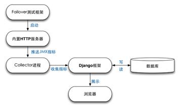

图3-2 数据展示模块架构图

由于内嵌的HTTP服务器只能展示当前测试框架的运行情况，包括测试框架运行的配置信息，在生产环境中我们还需要将这些数据持久化保存到数据库中，进行后期的统计和分析。因此我们采取由Collector来拉取数据的架构模式，如图3-2所示，Failover测试框架运行时通过JXM上报自身的Metrics，这些Metrics是由当前进程运行信息组成的JSON数据，这些指标暴露在特定的端口上。我们利用了我们另一个开源系统Minos[18]，使用项目中的Django这个Web框架，通过一个Collector进程拉取这些指标，持久化到MySQL数据库中，最后在Web页面展示测试框架长期的运行情况。

虽然有了不错的Web UI供我们观察，但实际发生测试失败的次数毕竟很少，我们需要一种报警机制而不是由开发者定期去考察系统状态。这是一种非常适合Notification而不是Polling的场景，我们需要实现邮件报警功能，只有在测试不通过的情况才给我们开发者发报警邮件，这样就省去了大量后期运维的工作。利用公司搭建的邮件服务器和Python脚本，很容易就实现这个功能了。

最后在我们提供给测试人员使用的接口上，我们希望用户使用简单方便，但又必须提供灵活的可配置能力。所以我们生成最终的可执行文件必须是直接可用的，至于选择哪种Policy和Aciton、针对那个集群进行测试，这些都通过与HBase、HDFS一样的自描述的XML文件来配置。我们会自动生成一份默认的配置文件，测试人员直接修改里面的配置项就可以进行各种Failover测试了。当然如果你想要测试HBase或者HDFS系统，你还必须提供hbase-site.xml和hdfs-site.xml来指定要测试集群的配置。而针对开发人员的接口设计上，我们设计了纯虚基类这样的接口，开发者使用Java最基本的类继承就可以拓展原有的功能，这种模式没有改变原有框架的开发架构，也不会给开发者增加额外的学习负担。我们作为内部开发者，已经为这个分布式系统Failover测试框架添加了对HBase、HDFS系统的支持，无论是ActionProvider、DataValidator还是ClusterChecker都有针对这两个系统的测试组件。

### 3.3 本章小结

本章从总体介绍了分布式系统Failover测试框架的基本架构，介绍了系统的分层以及各层之间的关系。同时通过模块的划分将系统解耦，对外部各模块进行了详细的架构分析，对后面实现整个测试框架提供更清晰的思路。
 
## 第四章 测试框架的实现原理

### 4.1 测试框架实现概述

整个分布式系统Failover测试框架的实现遵循我们的需求分析和架构设计，每一个模块都必须满足原来的功能需求和非功能需求，同时项目开发时要有足够的单元测试来覆盖我们的实现代码。为了让开发者更好地使用和拓展这个Failover测试框架，基础框架的代码注释也应该是足够清晰的，每个函数都要有用法解释和参数说明，代码质量的高低也会影响后续的维护工作。下面将会详细讲解针对分布式系统的Failover测试框架的实现要点。

在开发语言上我们选择与开源界的Hadoop生态相同的Java，同样也使用Maven[19]来构建项目。这样做的好处是代码结构符合业界规范，项目依赖管理也容易，是Java项目开发的标准模式。根据Maven的规范，我们需要在pom.xml里面声明此项目的依赖，包括用于单元测试的JUnit、Mockito，用于序列化的Json-lib和测试框架功能时所依赖的HBase项目。由于Java本身就是跨平台的，各主流操作系统如Linux、Mac OS和Windows都有对应的Java虚拟机，Maven构建工具也是基于Java实现的，所以此分布式系统Failover测试框架并没有平台限制，在上述的操作系统都可以进行开发和部署运行。

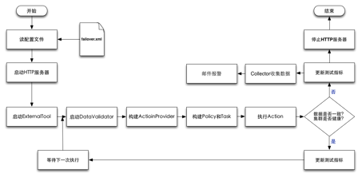

图4-1 系统流程图

根据图4-1我们可以清晰理解分布式系统Failover测试框架的运行原理。首先是从配置文件Failover.xml中读取配置项，然后启动内嵌的HTTP服务器来展示框架的运行信息，接着就开始运行ExternalTool这个外围测试工具，然后进入Failover测试的主循环。在主循环中首先启动DataValidator开始验证数据，然后根据前面的配置分别项构建ActionProvider、Policy和Task对象，然后从中选择Action来执行故障模拟。如果系统经过一轮Failover测试都没有出现异常，也就是通过了数据验证和集群的健康监测，就会更新测试指标然后等待下一次测试，否则会通过Collector收集指标进行邮件报警，测试框架回收系统资源并退出。

### 4.2 实现策略设计模式

策略设计模式[20]是指定义一个算法的序列，如前面提到分布式系统Failover测试框架的流程图，我们封装好系统的各个组件，通过接口让它们来交互，而在测试框架实际运行过程中根据用户配置随意替换。在此Failover测试框架中，各个组件如ActionProvider、Policy、DataValidator、ClusterChecker、ExternalTool等都封转成Java中的抽象类，调用者只需要知道接口就可以进行交互了。事实上我们已经实现了针对HBase、HDFS的各组件的子类，如HBaseActionProvider和HdfsActionProvider，用户在运行框架时只需指定这些子类即可替代原来的接口。由于不是每个分布式系统都需要ExternalTool这样的组件，我们灵活地实现了NullExternalTool等各种空组件，缺省时不会对系统做任何操作，这样既保证了框架的可拓展性也不会为开发人员增加额外的负担。

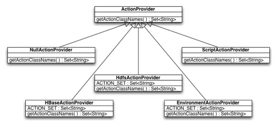

图4-2 ActionProvider类图

我们可以看到图4-2这个ActionProvider的类图，基类提供了虚函数getActionClassName()与外界交互，但这个函数必须由子类来实现。针对不同分布式系统我们实现了不同的子类，每个子类重写的这个函数将会返回针对这个分布式系统的可执行的故障模拟类型。这样我们只需在系统运行前配置好要使用的ActionProvider，就可以自动使用这个ActionProvider所提供的错误注入功能了。

同理，在FailoverFramework.java中，runFramework()里面用到的框架组件也都只是他们的纯虚父类，由于已经定义好接口，所以组件之间可以正常地交互，而实际上的交互逻辑都由子类来实现的。所有框架用到的ActionProvider、DataValidator、ClusterChecker、Policy和ExternalTool都是虚类对象的引用，只有在运行时反射出用户指定的子类对象，最终执行用户所期待的故障模拟或者数据验证行为。

### 4.3 实现系统三层架构

在分布式系统Failover测试框架中，Policy表示选择和执行Action的策略，它从ActionProvider给定的故障集合中选择Action，制定出相应的策略，然后生成一个特定的Task来执行。所以如果想要拓展Policy的话，只需集成Policy基类并重载selectActionsToCreateTask()这个函数就可以了。而Task则维护了一次Failover测试相关的Action集合和这次Task执行的时间戳，每个Task可以包含一个或多个Action。其中的Action就是一次故障模拟的具体实现，为了支持多个Action同时执行，我们实现的Action都继承了Java的Runnable接口，而且加入的Action执行结果的时间的统计，我们要拓展新的错误注入只需要继承这个类即可。我们在实现这三层架构时，由于Policy和Action都是可拓展的，这里充分利用了Java里面虚类的概念，代码依赖时只需要提供交互的接口，只有在真正运行时才会用实现类来代替这个基类。目前我们已经实现了RandomActionPolicy、OneByOneActionPolicy和ReplayActionPolicy这三种策略，这种清晰的架构划分为我们拓展自定义的Policy时提供了便捷的方式。

我们可以简单看看RandomActionPolicy.java的源代码，首先是继承了Policy基类并重写了selectActionsToCreateTask()这个虚函数。第一步根据整个actionSet随机选取一定数量的Action，然后利用选出来的Action集合创建一个最基本的Task。实际上运行Action的逻辑都在Task这个类里面，根据给定的Action类名反射出Action对象，然后为每一个Action对象创建新的线程来执行。当然在执行完所有的Action后，这个Task的信息也会记录到本地的一个Log文件中，这个文件能够被后面将会提到的ReplayActionPolicy用来重现故障了。

### 4.4 实现参数可配置化

前面提到我们实现的Policy目前有三个，而实现的全部Action也有三十个之多，具体使用那些系统参数来运行这个Failover测试，这些都需要通过配置文件来指定的。通过系统地调研，我们认为自解析的XML文件十分适合作为我们分布式系统Failover测试框架的配置文件。即使用户在不了解测试框架的具体实现时，他们也能通过修改配置项达到自己的测试目的，不过这需要我们在系统读取配置项时做更多的工作。我们在测试框架中大量地采用了工厂设计模式，同时利用Java的反射机制，只有在运行时才生成确定要使用的类。例如我们可以指定RandomActionPolicy、HBaseActionProvider和HBaseDataValidator，这几个类的使用都不是硬编码到测试框架中，而是由测试框架去读取配置文件，当读到用于指定的类名时直接反射出这个类的对象，从用户的角度也不需要知道这个类具体的实现，只要配置好相应的参数就可以了。这是一种开放性的系统架构，允许其他人拓展我们测试框架的任意一个组件，如由开发人员自定义Policy或者ExternalTool，然后直接在配置文件里指定自定义的类名即可，无须修改框架的任意一行代码，做到可插拔、易拓展。

我们可以看一下Failover.xml这个配置文件，里面有多个配置项的标签，标签的Key表示需要配置的项，Value表示这个配置项的值。可以看出，我们几乎可以配置这个框架的所有组件，如ActionProvider、DataValidator、ClusterChecker、Policy和ExternalTool的类名，还有针对ReployActionPolicy所要Replay的Log文件名和Timestamp等等。所有的可选值都列举在配置文件中，测试人员无需阅读框架源代码就可以快速使用框架的所有功能，通过任意文本编辑器即可修改配置文件，无须依赖额外的客户端来实现此功能。

### 4.5 实现故障重现功能

我们调研了目前主流的Failover测试框架，大多都实现了基本的错误注入功能，但是一旦框架测试出系统的Bug时，它们大都无法重现这个问题，因此很可能由于无法重现而忽略掉这个系统潜在的问题了。而我们的测试框架在设计时就考虑到这一点，我们将运行一次Failover测试所有的Action都抽象成一个Task，每个Task执行结束后都会将自身信息持久化到本地的文件中。当执行完其中一个Task后发现被测系统存在问题，我们可以迅速从本地文件中找到这个Task的信息，然后通过选用ReplayActionPolicy马上Replay这个故障。Replay功能也允许我们针对特定的Task进行不同频度的测试，这种灵活的执行方式大大提高了故障重现的概率，也让我们在发现和定位问题时更加有把握了。

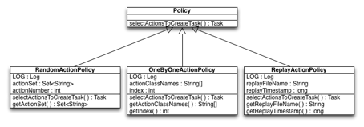

图4-3 Policy类图

如图4-3，我们的Replay功能是通过拓展Policy来实现的。要使用Replay功能，需要在Failover.xml指定replay.file.name和replay.timestamp，同时提供这两个配置项才可以指向唯一的Task。Policy基类本身要求提供一个selectActionToCreateTask()这样的方法，普通的RandomActionPolicy和OneByOneActionPolicy都是直接从ActionProvider中选择Action然后直接返回。但ReplayActionPolicy相对复杂，首先它内部有两个成员变量replayFileName和replayTimestamp，表明要Replay的Log文件名和指定Task对应的时间戳。通过这两个变量可以指定唯一的Task，然后通过反序列化这个文件的内容，就可以得到一组Action信息并进行Replay了。

### 4.6 实现数据验证功能

数据验证功能也是当前主流的Failover测试框架所缺少的一个重要组件，一味地对系统进行错误注入是没有意义的，我们还需要知道系统在Failover过程中能否保持预期的服务质量。因此，很多人在进行错误注入的同时，会手动启动一些客户端来请求被测的集群，这样做的弊端是给测试人员增添了额外的运维工作。而且在客户端访问失败后，测试框架不能及时通知测试人员，于是我们讨论决定将这部分功能集成到我们的分布式系统Failover测试框架中。不同系统的数据验证方式是不同的，我们将这种功能抽象成DataValidator的接口，如我们专门为HBase和HDFS实现的HBaseDataValidator、HdfsDataValidator工具，在集群进行Failover测试时从客户端的角度不断读写数据库，理论上这种Failover测试对客户端应该是透明的，如果出现数据一致性问题就可以确定系统存在正确性的Bug了。

我们针对HBase实现了一个HBaseDataValidator工具，用户可以针对各自的分布式系统实现自己的验证工具，只需要实现基类的startValidator()、stopValidator()和isDataConsistent()这三个虚函数即可。而HBaseDataValidator也实现了这三个函数，在startValidator()里面启动了三个线程分别写数据库、读数据和删除数据库中的数据，同时也会在内存中保留这些读写记录。stopValidator()时结束线程并回收资源。当外界调用isDataConsistent()时返回验证结果，由于我们内存中有所有增删改的记录，所有每次读数据库时都会将读到的值也内存的作比较，如果不一致证明HBase数据库返回的数据时不一致的。其他系统可以参考这种模式，实现针对各自分布式系统的数据验证工具。

### 4.7 实现页面展示功能

以下是分布式系统Failover测试框架的页面展示模块截图。 

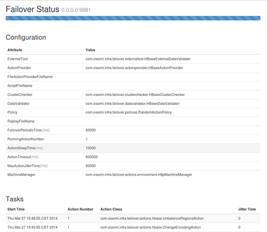

图4-4 页面展示模块截图

我们在运行Failover测试框架时，通过服务器指定的IP和端口就可以访问这次Failover测试的配置以及运行情况，这有赖于我们框架实现的内嵌HTTP服务器。我们参考了HBase中InfoServer的实现，通过创建一个新的Jetty服务器来接受浏览器的请求，然后使用Servlet获取动态内容，最后经过Jamon模板引擎生成静态的HTML页面。只要Failover测试框架在运行，内嵌的服务器就可以提供服务，任何人都可以通过浏览器查看这次Failover测试的配置和跑过的Task情况，解放了测试人员运维时不断登录到服务器查Log的麻烦，界面友好的Web UI也是作为一个成熟框架很重要的一部分。

图4-4是最终的页面展示效果图，这个网页是一个相对静态的页面，数据没有持久化到数据库中，都是由Failover测试框架内的Servlet传到HTML模板里的。整个页面都使用Bootstrap这个框架进行美化，因此只需要少量的代码就可以做出整洁优雅的效果，甚至不需要手动写CSS和JavaScript代码。

实际上页面展示的服务器代码比较晦涩，我们使用了Jamon模板，实现了FailoverStatusTemplate.jamon，通过Failover测试框架的主程序把系统配置的Configuration对象和Task对象传进来，然后在页面上展示这些动态信息。我们通过HTML基本语法搭建整个页面的结构，动态内容使用Jamon拓展的标签即可获得。用户在Failover测试框架运行起来后，只需用浏览器打开指定的IP和端口就可以看到这个框架运行的详细信息了。

### 4.8 实现数据统计功能

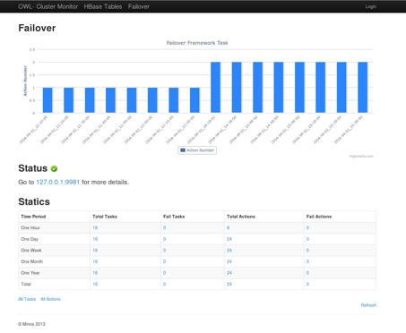

图4-5 数据统计模块截图

前面提到Failover测试过程中框架会启动内嵌的HTTP服务器，同时它也会通过标准的JMX格式吐出系统当前运行的Task信息，在服务器IP和端口后面加上“/jmx”就可以看到了。在实际的生产环境中，我们通过分布式系统Failover测试框架吐出的系统Metrics，利用自己实现的Collector模块来收集这些信息，然后持久化到我们的MySQL数据库中，最后利用Django来做数据分析以及统计功能。如图4-5就是我们数据统计模块的截图，测试框架的数据从数据库中取出后，使用HighChart这个画图框架画出柱状图，其余的数据按照一个小时、一天、一周、一个月和一年的时间跨度进行分类统计。而且每个数据都可以点进去查看这段时间内Failover测试框架的运行情况。

我们的测试框架只实现了Metrics的Push，而由外部系统实现Pull，这样充分解耦了这两个不同模块的功能，甚至允许开发者实现自己的数据处理和分析工作，当然我们也提供了一套开源的收集与展示的解决方案。

同时我们在收集到框架测出的系统异常时，利用公司提供的邮件服务器，通过编写简单的Python脚本就可以向我们开发者发送邮件报警了。邮件报警功能使用Python的smtplib模块很容易就可以实现了，通过这个库创建一个SMTP对象，根据用户名密码登陆后，直接调用sendmail()就可以发送邮件了。不过由于这个依赖于内部的服务器支持，需要给定用户名和密码，这里也就不再详述了。这个功能虽然简单不过也省去了我们后续大量的运维时间和成本。

### 4.9 实现硬件级别故障

以下是分布式系统Failover测试框架的硬件故障模拟架构图。

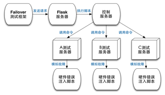

图4-6 硬件故障模块架构图

图4-6表示了我们实现硬件故障模块的基础架构，这部分功能比较独立，我们称之为MachineFailover项目。

MachineFailover提供一个HTTP的接口，Failover测试框架可以通过这个接口发送来错误注入命令。接受客户端请求的是一个用Python实现的Flask服务器，这个服务器接收到请求后就开始执行脚本，这个脚本会向真正的被测服务器发送模拟故障的命令。至于为何不直接向被测服务器发送命令呢，原因是我们运行Failover测试框架的机器与被测服务器可能没有建立Root信任关系，因此没有权限直接调用故障模拟的脚本。其次是基于安全考虑，我们使用统一的控制服务器来接受错误注入请求有利于我们定位问题，同时减低程序或者用户误操作的可能。

硬件级别的故障模拟是我们框架设计就考虑的一个要点，由于这与底层的服务器相关，而且不同公司的服务器运行环境也各不相同，我们实现的MachineFailover就要解决这类问题。这个系统包含了模拟CPU、内存、磁盘、网络等几乎硬件故障的软件和工具，可以很方便地部署到我们的服务器上，而且它还实现了一个作为控制中心的HTTP服务器，为不是直接SSH的环境提供了更多访问接口。分布式Failover测试框架本身包含了硬件级别的错误注入，而实际上它需要依赖于服务端提供的故障模拟服务，我们在测试框架中保留了对这种服务的访问接口，只要服务器使用MachineFailover或者自定义的故障模拟服务，我们就可以轻易地从客户端进行硬件级别的Failover测试了。

MachineFailover的HTTP服务器是一个Flask程序，只是通过接受不同URL的请求来调用不同的脚本。而真正执行故障模拟的是一系列Shell脚本，这些脚本的执行需要提前配置好环境，具体的配置因不同操作系统而异。因为模拟磁盘损坏、网络异常、内存不足等错误的方法都不一样，我们就做成统一的脚本，所有命令都通过这个脚本发出，部署到服务器时也只需要把这个程序拷贝过去就可以了。

### 4.10 实现外围测试工具

虽然我们每次Failover测试时都会执行框架提供的数据验证工具DataValidator，但在两次测试的间隙和一些不可预知的情况下，我们还是需要一个全局的工具来保证系统的稳定，这就是外围测试工具ExternalTool的价值。ExternalTool会在框架启动之初就被执行，只有在整个Failover测试框架停止前才会结束验证，在针对HBase集群的测试中，我们实现的HBaseExternalDataValidator就重用了HBaseDataValidator，因为我们必须保证在整个Failvoer测试包括两次测试的间隙都确保数据的一致性。外围测试工具也可以实现其他的验证功能，我们把这个部件集成到测试框架中，开发者可以像Policy那样轻易地拓展成自己需要的工具。

我们通过拓展ExternalTool实现一个针对HBase的外围验证工具，当然如果有不同需求也可以实现不同的逻辑。如果不需要这个功能，可以使用缺省的NullExternalTool，这个程序不会做额外的数据验证工作，当然也不会影响到原有框架的执行。

### 4.11 实现通用测试模块

在实现完针对HBase和HDFS的Failover测试后，我们还想利用这个框架已经做好的数据展示、邮件报警等功能，完成对ZooKeeper和我们内部实现的Chronos的Failover测试，发现还要为不同的系统编写Action子类，编译后才能执行。而且我们发现大部分系统的Fail命令和Recover命令都可以在命令行中执行，于是我们萌生了实现ScriptAction的意愿。

ScriptAction是一个通用的Action，只需要将你要执行的命令放到一个脚本中，在运行Failover框架前修改配置文件指定调用这个脚本，这样你无须修改测试框架源代码就可以执行动态的命令了。通过这个拓展，我们在没有修改框架一行代码的情况下，实现了对ZooKeeper和Chronos系统的Failover测试，运行情况也相当让人满意。

这个类的具体实现是ScriptAction.java，它通过Failover.xml这个配置文件获得要执行的脚本名字，然后使用Java的Runtime类来执行。和其他Action一样，这个Action也要有一个类型名为Script，而且必须实现perform()这个虚函数，而一旦外部脚本执行出错，它也会立刻抛出异常表示这个Action执行出错了。

### 4.12 实现工厂设计模式

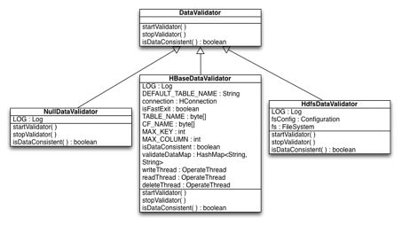

图4-7 DataValidator类图

工厂设计模式[21]是指通过定义一个接口来创建对象，这些子类对象都由统一的工厂类来初始化。我们在测试框架中大量的运用了工厂设计模式，实现了ActionProviderFactory、ClusterCheckerFactory、DataValidatorFactory、PolicyFactory和ExternalToolFactory这些工厂类，由这些工厂类来创建各个子类对象。这样做的好处是所有子类的初始化都由同一个接口来完成，而且初始化这些对象的参数可以统一处理，我们是通过配置文件传进去的，这样用户要设置也十分简单。

如图4-7是DataValidator这个类的类图，可以看到基类DataValidator的三个方法startValidator()、stopValidator()和isDataConsistent()都是虚函数，需要子类去实现。我们首先实现了NullDataValidator这个子类，顾名思义这个类并不会执行实际的数据验证工作，当我们的系统不需要数据验证时使用它就可以了，整个测试框架的结构依然不变。可以看到我们也实现了HBaseDataValidator和HdfsDataValidator，这两个类是针对HBase和HDFS进行数据验证的，如果我们正想要测这两个系统就可以直接使用这两个类了。

我们也实现了DataValidatorFactory这个工厂类，看一下ActionProvider.java这个文件的源代码，只有一个被定义为static的createDataValidator(String)函数，这个函数只需要接收一个DataValidator子类的类名，就可以通过Java的放射机制创建出一个DataValidator对象，实现了不同参数创建不同对象的功能。

### 4.13 本章小结

本章将分布式系统Failover测试框架的分解成12个功能模块，然后分别对各个功能模块进行了详细的介绍。通过画图和代码剖析的方式，力求让读者对整个Failover测试框架有更清晰的认识，也能从中了解到该系统开发时的实现细节。

## 第五章 测试框架的最佳实践

### 5.1 实践概述

在Failover测试框架的开发过程以及开发完成后，我们已经针对HBase、HDFS、ZooKeeper以及Chronos系统进行了Failover测试。后面将会分别介绍它们的测试情况。

在易用性方面，这个测试框架在不断迭代的开发过程中已足够完善，只需要通过一个简单的配置文件就可以利用起全部的测试功能。而且只要首次配置好测试环境，后续的页面展示、指标收集以及历史数据统计都可以持续进行，无须人为参与，框架运行信息通过Web UI展示，测试人员无须安装额外的客户端软件即可查看。

在实用性方面，Failover基本满足了我们的需求，通过不断地执行错误注入并且进行数据验证，很好地考验了分布式系统的容灾能力。尤其在硬件故障的模拟上，如磁盘填满和机器重启等故障经常使系统崩溃或者异常，要求我们改进被测系统的架构来满足这种容灾要求。针对Chronos的Failover测试我们每十分钟跑一次，随即杀掉一个Chronos进程或者它所依赖的ZooKeeper进程，从客户端的角度会有一小段不可用时间但仍能恢复服务，经过连续一个星期的测试没有发现正确性问题，这也大大提高了我们使用Chronos的信心。

### 5.2 实践系统

以下是我们对各分布式系统进行Failover测试的对比图。


图5-1 分布式系统对比图

HBase是根据BigTable[22]一个开源的分布式数据库，也是我们框架设计时考虑到最重要的被测系统。它本身包含基于ZooKeeper的HA（高可用性）机制，在软硬件故障发生后进行Failover，理论上不会影响数据的一致性，但线上的HBase集群却屡次由于系统的Bug导致丢数据的情况。因此，利用Failover测试框架测试HBase可能潜在的问题，更有助于我们完善这个系统。在进行强制重启服务器这种硬件故障时，HBase系统中RegionServer不能被自动拉起这种情况多次出现了，我们通过Log日志找到了直接的原因，修改代码后也修复了这个Bug，通过这次Failover测试也提高了HBase的健壮性。

HDFS[23]是一个分布式的文件系统，它也有自身的HA机制保证部分服务器挂了不会影响整个集群，而且通过多备份的形式也可以保证数据不会丢失。同样利用Failover测试框架来测试HDFS的这些特性，也有利于找的系统潜在的问题。目前我们只是对HDFS文件系统进行简单的创建文件、修改文件和删除文件这些操作，虽然还没有找到系统的漏洞，但是在这种持久、频繁的压力下系统能保持稳定，让我们对线上的集群也充满信心。

ZooKeeper[24]是一个分布式的协同服务，它通过提供简单的原语让其他应用很容易就可以实现一致性的服务，而它本身实现了Fast Paxos协议，任何一台机器挂了也不会影响自身的服务。我们使用Failover测试框架不断启停ZooKeeper进程，经过外部系统的测试可以检验ZooKeeper是否能维持这种保证。我们对ZooKeeper进行了简单的测试，不断启停单台ZooKeeper服务器，即使部分服务器不能提供服务，整个集群还是能选出Master，同样我们也觉得线上的集群可以承受这样的故障发生。

Chronos是一个提供全局严格单调递增Timestamp的服务，它依赖ZooKeeper[25]实现主被切换和服务端的Failover，保证在同时启动多台服务器的情况下，任意一台服务器挂了都能迅速恢复服务。实际上除了服务器宕机，CPU占用率过高、磁盘损坏和网络不可用等因素都可能造成系统问题，我们通过Failover测试框架模拟了这些故障，经过测试后可以判断Chronos确实能在Failover时保证高可用。

### 5.3 实践问题

不过在实践过程中我们也发现了一些问题，在对HBase很长的一段时间进行Failover测试，都没有邮件报告系统的问题。实际上HBase曾经在几十分钟内都是不可用的，虽然没有正确性问题但这并不是我们预期的行为，我们发现我们对HBase集群健康检测的条件设置比较宽松，即使几十分钟不可用也没有邮件报警，后续通过对框架的改进可以解决这个问题。还有一个问题就是Failover测试框架运行很长一段时间后自行推出了，通过日志看出框架本身存在内存滥用而且没有释放相关资源，这个问题也希望在后续的迭代开发中解决。

### 5.4 本章小结

本章讲述了我们使用此Failover测试框架的最佳实践，从易用性和实用性方面进行总结。同时在实践过程中对几个分布式系统分别进行Failover测试，能够发现系统存在的缺陷，这些测试也极大提高了对我们系统的信心。不过测试过程中也找到了框架本身存在的问题，需要我们在此测试框架的开发中继续完善。
 
## 结论

分布式系统Failover测试框架可以说是随着互联网的发展应运而生的，大数据的存储与计算给传统计算机架构带来了革新，采用廉价的普通计算机组合分布式集群成为新的解决方案，在越来越重视用户体验和服务质量的今天，实现高可用的分布式系统是最基本的要求，同时Failover测试也成为了系统测试中不可或缺的一环。

而我们的Failover测试框架正迎合这种趋势，为已有的分布式存储和计算平台提供软硬层级别的Failover测试，而且框架保证良好的可拓展性和易用性，能够轻易满足的各类软件的测试需求，也以其开放性可以兼容新的分布式系统。通过这样一个系统的开发， 不仅满足我们对分布式系统的测试需求，也希望能带动软件测试行业与互联网发展共同前行。

在Failover测试框架的实现也应用过程中，我们也加深了对Failover测试的理解，更加重视Failover测试，在拓展原有测试框架功能的同时，将它应用到我们已有的分布式系统中，并且找到了系统的漏洞，也大大提高了我们对这些系统的信心。
 

## 参考文献

* [1] George Coulouris 《分布式系统概念与设计》 第四版 机械工业出版社 2008-1
* [2] 维基百科关于高可用性 http://en.wikipedia.org/wiki/High_availability
* [3] 维基百科关于Failover https://en.wikipedia.org/wiki/Failover 
* [4] 施迎 《捉虫记--大容量Web应用性能测试与LoadRunner实战》 清华大学出版社 2010-6
* [5] Leslie Lamport The part-time parliament ACM TOCS 16.2(May 1998)
* [6] Netflix ChaosMonkey http://techblog.netflix.com/2012/07/chaos-monkey-released-into-wild.html 
* [7] Prefail一个可编程错误注入框架 UCB/EECS-2011-30 
* [8] HBase项目主页 https://hbase.apache.org/ 
* [9] HDFS项目主页 http://hadoop.apache.org/docs/r1.2.1/hdfs_user_guide.html
* [10] ZooKeeper项目主页 http://zookeeper.apache.org/
* [11] Chronos项目主页 https://github.com/XiaoMi/chronos
* [12] Apache HBase测试主页 http://hbase.apache.org/book/hbase.tests.html 
* [13] Lars George 《HBase : The Definitive Guide》 O'Reilly Media 2011-9-20
* [14] SimianArmy项目主页 https://github.com/Netflix/SimianArmy
* [15] HBase新Failover测试框架Jira https://issues.apache.org/jira/browse/HBASE-9802 
* [16] Gremlins项目主页 https://github.com/toddlipcon/gremlins 
* [17] 模拟机器故障 http://bigdata-blog.net/2013/12/13/模拟机器故障
* [18] Minos项目主页 https://github.com/XiaoMi/minos
* [19] 徐晓斌 《Maven实战》 机械工业出版社 2010-12
* [20] 程杰 《大话设计模式》 清华大学出版社 2007-12
* [21] 维基百科关于工厂设计模式 http://en.wikipedia.org/wiki/Factory_method_pattern
* [22] Jeffrey Dean BigTable: A Distributed Storage System For Structed Data OSDI 2006 
* [23] Hadoop Distributed File System 978-1-4244-7153-9/10/ ©2010 IEEE 
* [24] Patrick Hunt ZooKeeper: Wait-free coordination for Internet-scale systems
* [25] Flavio Junqueira 《ZooKeeper: Distributed Process Coordination》 O’Reilly Media 2013-11-29 

## 致谢

感谢李红老师在我撰写论文时给予的帮助和支持，提醒论文的完成进度和格式要求。没有这些督促也没有这篇论文的诞生，本论文的正文结构和排版规范也离不开李红老师带领的毕业生小组中其他同学的帮助。

感谢小米云存储团队在此项目初期的讨论和分析工作，在小米宽松的工作环境下可以最终完成这个项目。感谢部门Leader的任务安排，也感谢其他同事的交流与合作。

